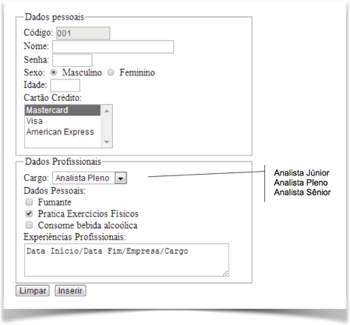

# Exercícios: HTML

## Introdução

Para realização e entrega dos exercícios, siga as instruções disponíveis na página da disciplina. Para cada questão, gere um commit específico!!

### Notícia do dia

Implemente a página HTML que represente uma notícia do dia. Essa página deverá conter um título, subtítulo, e vários parágrafos, representando o texto da notícia.

Dica: utilize as tags `<h1>`, `<h2>` e `
` para implementação da página

### Prova de Múltipla Escolha

Elabore uma lista de exercícios com cinco questões de múltipla escolha, que aborda qualquer um dos temas já vistos anteriormente no curso. As questões deverão ter 4 alternativas, e apenas uma deverá ser a correta.

Dica: utilize as tags `<ol>` e `<ul>`

#### Prova de Múltipla Escolha - Respostas

Elabore uma página com o gabarito para as questões anteriores. O gabarito deverá estar organizado no formato de uma tabela.

Dica: utilize as tags* `<table>`, `<tr>`, `<td>`

## Elementos HTML

### Manual de Programação

Ajude os calouros no aprendizado de programação em linguagem C!

Você deverá implementar uma página em HTML que explique as instruções básicas da linguagem:

* Introdução 
* Variáveis e expressões matemáticas
* Estruturas Condicionais
* Estruturas de Repetição
* Como executar um programa em C

Os tópicos deverão se entitulados utilizando o elemento `<h2>`, e separados por *containers*.

Ainda, cada seção deverá possuir pelo menos um exemplo de código que ilustra o uso do tópico selecionado. 

### Formulário de cadastro

Implemente um formulário HTML conforme a imagem a seguir:

